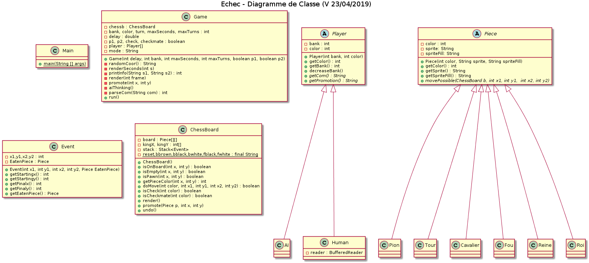

# Projet IN404 - Chess

## La Dev Team
- Chabé Paul Victor 
- Dankou Mathis
- Naze Franck
- Soursou Adrien
## Objectifs
- [x] Base du projet
	- jeu d'échec fonctionnel avec une interface textuelle
	- IA (coups aléatoires)
- [x] Détection des situations d'échecs et d'échecs et mat
- [x] Promotion des pions
- [x] Commande Undo
- [x] (Optionnel) Affichage du plateau
- [x] (Optionnel) Ajout d'un timer
- [ ] (En plus) Option Dragon !
- [x] (En plus) Option mode Blitz !

## Manuel Utilisateur
### Lancement :
```shell
./chess [OPTION]...
```
Pour lancer une simple partie contre l'IA :
```shell
./chess
```
ou
```shell
./chess -p1 human -p2 ai

```

### Liste des options :
- **-d, --delay [instant|slow|normal|fast]** définit un délai d'attente après le tour de l'IA
- **-b, --bank [entier]** définit une banque de temps pour chaque joueur (0 pour désactiver)
- **-s, --seconds [entier]** définit le nombre maximum de secondes par tour (0 pour désactiver)
- **-t, --seconds [entier]** définit le nombre maximum de tours (0 pour désactiver)
- **-p1, --player1 [ai|human]** permet de sélectionner si le joueur est humain
- **-p2, --player2 [ai|human]** même fonction que pour le joueur 1
- **--help** affiche la liste des options
- **--version** affiche les informations de version

La commande exécutée par défaut est:
```shell
./chess -d normal -b 0 -s 0 -t 0 -p1 human -p2 ai
```
Remarques:

*- Eviter de lancer des batailles d'IAs sans limiter le nombre de tours.*

*- Certaines polices d'écriture décalent l'affichage des pièces sur le terminal.*

### Commandes :
- **undo** : reviens au coup précédent
- **exit** : quitte la partie
- **[a-h][1-8][a-h][1-8]** : position de départ vers position d'arrivée. Ex: b5d7 déplace la pièce de b5 vers d7 si le déplacement est valide

## Manuel Technique

### Architecture :
3 groupes de classes peuvent être identifiés:
 - Les **Classes principales** : La classe **Main** permet de lancer le programme, il interpréte également les commandes qu'on lui a fourni. La classe **Game** à l'aide de la classe **ChessBoard** gère la partie et le plateau dans son ensemble ainsi que l'affichage, il assure l'interprétation des commandes de jeu également . La classe **Event** permet au **ChessBoard** de garder en mémoire les coups joués durant la partie. 
 - Les **Pièces** : Chaque pièce hérite de la classe abstraite ***Piece***, contenant les données importantes telles que la couleur et les images de chaque pièce. Chaque pièce implémente la méthode abstraite *movePossible* afin qu'elle s'adapte aux différents mouvements qu'elle peut effectuer.
 - Les **Joueurs** : La classe abstraite ***Player*** contient les fonctions abstraites *getCom* et *getPromotion* permettant respectivement de renvoyer leur choix de commande et de promotion. Les classes **AI** et **Human**  les implémentent toutes deux.  **AI** utilise fortement l'aléatoire tandis que **Human** récupère la commande de l'utilisateur via un BufferedReader.
### Affichage :
Le plateau et les pièces sont affichées directement sur le terminal en utilisant des caractères d'échappement. 2 caractères unicodes, appelés *sprite* sont nécessaires pour l'affichage de pièces sur case noir et sur case blanche.
L'animation du timer nécessite une mise à jour de l'affichage à chaque seconde écoulée.
### Option :
Les Options sont collectées dans la classe **Main** et sert à l'instantiation de l'objet **Game**
